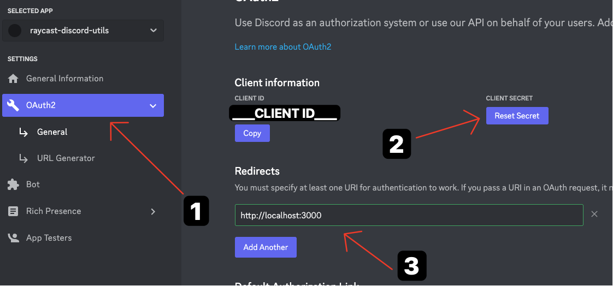
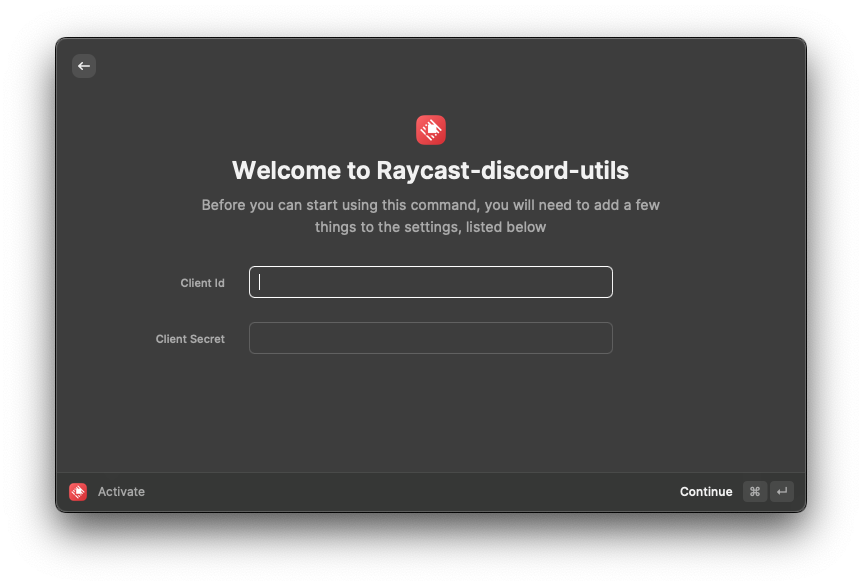

# raycast discord utils

Discord is manipulated using the RPC API

# How to use

## Create Discord App

## Create client seclet & Set redirect URL

Please set the redirect URL to "https://localhost:3000".

## Configure values

Set the values that you created earlier.

## Activate Discord

Run "Activate" command
